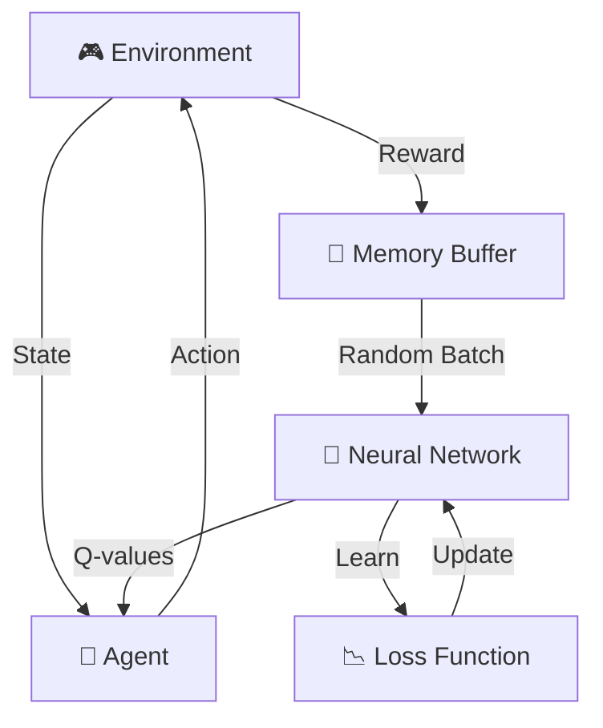

# Reinforcement Learning | From Zero to Hero

<div align="center">

**Master Reinforcement Learning from scratch using Deep Q-Networks (DQN)**

*A hands-on beginner's guide to understanding how AI agents learn through trial and error*

</div>

---

## 📖 What is Reinforcement Learning?

Think of teaching a dog tricks:
1. 🐕 Dog tries different actions
2. 🦴 Gets treats for good behavior
3. 🧠 Learns which actions earn rewards

**Reinforcement Learning** works the same way for AI!

### The Learning Cycle

```
┌─────────┐          ┌─────────────┐          ┌─────────┐
│  Agent  │ ─Action─→│ Environment │─Reward──→│  Agent  │
│         │←─State───│             │          │ Learns  │
└─────────┘          └─────────────┘          └─────────┘
```

### RL vs Other Machine Learning

| Traditional ML | Reinforcement Learning |
|----------------|------------------------|
| Learns from labeled examples | Learns from trial and error |
| "This is a cat" | "That action got +10 points!" |
| One-shot prediction | Sequential decision making |
| Static dataset | Interactive environment |

> **Core Idea:** The agent discovers the best strategy by trying actions and learning from rewards.

---

##  1. The CartPole Challenge

### 🎪 Imagine This Scenario
You're balancing a broomstick on your palm. It starts tilting left — you move your hand left to catch it. Too far? Now move right! That's exactly what our AI learns to do.


###  Game Mechanics

| Element | Details |
|---------|---------|
| **🎯 Goal** | Keep pole upright as long as possible |
| **📍 State** | 4 numbers: cart position, cart speed, pole angle, pole rotation speed |
| **🎮 Actions** | Move left (0) or Move right (1) |
| **🎁 Reward** | +1 point for every moment pole stays balanced |
| **❌ Game Over** | Pole tilts >12°, cart exits bounds, or 500 steps reached |

### 💡 Why Start with CartPole?

| Reason | Benefit |
|--------|---------|
| 🎯 Simple physics | Focus on RL concepts, not game complexity |
| 📏 Small state space | Only 4 numbers to track |
| ⚡ Fast training | See results in minutes, not hours |
| 🎓 Educational | Every RL concept appears here |

---

## 🧠 2. Deep Q-Network (DQN) Explained

### What's a Q-Value? 🤔

Imagine you're playing chess. A Q-value tells you: **"How good is this move in this position?"**

```
Q(state, action) = Expected total future score if I take this action
```

**Example:**
- State: Pole tilting left at 5°
- Action: Move cart left
- Q-value: 450 (this is a GREAT move!)

###  Traditional vs Deep Q-Learning

<table>
<tr>
<th>Q-Learning (Old School)</th>
<th>Deep Q-Learning (Modern)</th>
</tr>
<tr>
<td>

```
┌─────┬──────┬──────┐
│State│Left  │Right │
├─────┼──────┼──────┤
│  1  │ 10.5 │  8.2 │
│  2  │  7.1 │ 12.3 │
└─────┴──────┴──────┘
   ↑ Q-Table
```

</td>
<td>

```
   State (4 numbers)
         ↓
   ┌──────────┐
   │  Neural  │
   │ Network  │
   └──────────┘
         ↓
   [Q(left), Q(right)]
```

</td>
</tr>
<tr>
<td>❌ Can't handle millions of states</td>
<td>✅ Learns patterns across all states</td>
</tr>
</table>

### 🧮 The Bellman Equation (The Secret Sauce)

```
Q(current_state, action) = immediate_reward + γ × best_future_Q_value
                            ─────────────────   ─   ──────────────────
                                 Now           |        Later
                                             Discount
                                              factor
```

**In plain English:**
> "The value of an action = the reward you get NOW + the best you can do LATER"

**Real example:**
- Move cart left now: +1 reward
- Best future if pole stays balanced: +499
- Discount factor (γ = 0.99): Care slightly less about distant future
- **Total Q-value: 1 + 0.99 × 499 = 495.01**

---

## 🏗️ 3. How DQN Works: The Complete Journey

### 🗺️ The Big Picture



### 📚 Learning Steps Breakdown

<details>
<summary><b>🔹 Step 1: Environment Setup</b></summary>

```python
import gymnasium as gym
env = gym.make('CartPole-v1')
state = env.reset()  # Start a new game
```

Get the playground ready!

</details>

<details>
<summary><b>🔹 Step 2: Understanding What We See</b></summary>

**State = 4 numbers:**
```python
[cart_position, cart_velocity, pole_angle, pole_angular_velocity]
Example: [0.02, -0.05, 0.03, 0.1]
```

- Cart position: -2.4 to 2.4 (left to right)
- Cart velocity: how fast it's moving
- Pole angle: -0.21 to 0.21 radians (~12°)
- Pole angular velocity: how fast it's rotating

</details>

<details>
<summary><b>🔹 Step 3: Random Agent (The Baseline)</b></summary>

```python
# Let's try random actions
action = random.choice([0, 1])  # Random left or right
```

**Result:** Pole falls in ~20 steps 📉

**Lesson:** Random guessing doesn't work. We need intelligence!

</details>

<details>
<summary><b>🔹 Step 4: Building the Brain (Neural Network)</b></summary>

```python
Input Layer:  [4 neurons]  ← State
Hidden Layer: [128 neurons] ← Processing
Hidden Layer: [128 neurons] ← More processing
Output Layer: [2 neurons]  ← Q-values for [left, right]
```

**The network learns:** "Given this state, which action has higher value?"

</details>

<details>
<summary><b>🔹 Step 5: Exploration vs Exploitation (ε-Greedy)</b></summary>

```python
if random() < epsilon:
    action = random_action()  # 🎲 Explore
else:
    action = best_action()    # 🎯 Exploit
```

| Phase | Epsilon | Behavior |
|-------|---------|----------|
| Early training | 1.0 → 0.5 | Mostly exploring |
| Mid training | 0.5 → 0.1 | Balanced |
| Late training | 0.1 → 0.01 | Mostly exploiting learned policy |

**Why?** Like learning to cook — first you experiment (explore), then you perfect your recipe (exploit).

</details>

<details>
<summary><b>🔹 Step 6: Memory (Experience Replay Buffer)</b></summary>

```python
memory = []
memory.append((state, action, reward, next_state, done))
```

**Stores experiences like:** "When I was at position 0.5, I moved left, got +1 reward, and ended at position 0.48"

**Benefits:**
- 🔄 Break correlation (don't learn only from consecutive steps)
- 📚 Learn from past mistakes multiple times
- 🎯 Stable training

</details>

<details>
<summary><b>🔹 Step 7: Two Brains Are Better Than One (Target Network)</b></summary>

**Problem:** If we update the network while using it as a target, training becomes unstable (chasing a moving target).

**Solution:** Use TWO networks!

| Network | Purpose | Update Frequency |
|---------|---------|------------------|
| 🧠 Policy Network | Picks actions | Every step |
| 🎯 Target Network | Provides stable targets | Every 100 steps |

</details>

<details>
<summary><b>🔹 Step 8: Learning (Training Loop)</b></summary>

```python
for episode in range(500):
    state = env.reset()
    total_reward = 0
    
    while not done:
        # 1. Pick action
        action = epsilon_greedy(state)
        
        # 2. Take action
        next_state, reward, done = env.step(action)
        
        # 3. Remember
        memory.store(state, action, reward, next_state, done)
        
        # 4. Learn from past
        if len(memory) > batch_size:
            batch = memory.sample()
            loss = compute_loss(batch)
            optimizer.step()
        
        # 5. Update target network occasionally
        if step % 100 == 0:
            target_network.copy(policy_network)
```

</details>

<details>
<summary><b>🔹 Step 9: The Loss Function</b></summary>

```python
# What we predicted
predicted_q = network(state)[action]

# What it should have been (Bellman equation)
target_q = reward + gamma * max(target_network(next_state))

# How wrong were we?
loss = (predicted_q - target_q)²
```

The network learns by minimizing this error!

</details>

---

## 📁 4. Project Structure

```
RL_CartPole_1/
│
├── 📂 venv/                          # Virtual environment
│   │
│   ├── 🎯 train_cartpole.py         # Main training script - START HERE!
│   ├── 🎮 play.py                   # Watch your trained agent perform
│   │
│   ├── 🧠 dqn_model.py              # Neural network architecture
│   ├── 💾 replay_buffer.py          # Experience replay memory
│   ├── 🎲 policy.py                 # ε-greedy action selection
│   ├── 🎯 target.py                 # Target network update logic
│   ├── 📈 train_step.py             # Single training iteration
│   │
│   ├── 💾 cartpole_dqn.pth          # Saved trained model (created after training)
│   │
│   └── 📂 testing/
│       └── test_files.py            # Unit tests
│
├── 📄 requirements.txt               # Python dependencies
└── 📖 README.md                      # You are here!
```

---

## ⚡ 5. Quick Start

### Prerequisites ✅

Before you begin, make sure you have:
- 🐍 Python 3.8 or higher ([Download](https://www.python.org/downloads/))
- 📦 pip (comes with Python)
- 💻 Git ([Download](https://git-scm.com/))

### Installation Steps

#### 1️⃣ Clone This Repository

```bash
git clone https://github.com/Bit-Bard/RL-CartPole.git
cd RL_CartPole_1
```

#### 2️⃣ Activate Virtual Environment

**Windows:**
```bash
venv\Scripts\activate
```

**macOS/Linux:**
```bash
source venv/bin/activate
```

You should see `(venv)` appear in your terminal.

#### 3️⃣ Install Dependencies

```bash
pip install -r requirements.txt
```

#### 4️⃣ Train Your Agent

```bash
python train_cartpole.py
```

**What you'll see:**
```
Episode 0: Reward = 23
Episode 50: Reward = 87
Episode 100: Reward = 156
Episode 200: Reward = 342
Episode 300: Reward = 500 ✅
...
Model saved as cartpole_dqn.pth
```
**Training takes:** ~5-10 minutes on a regular laptop

#### 5️⃣ Watch Your Trained Agent

```bash
python play.py
```

---

**Install command:**
```bash
pip install -r requirements.txt
```

---

## 📈 6. What to Expect During Training

### Training Progress Timeline

```
┌─────────────────────────────────────────────────┐
│  Episode    Avg Reward    Epsilon    Status    │
├─────────────────────────────────────────────────┤
│    0-50        20-40        1.0      🔍 Exploring │
│   50-100       40-100       0.7      🎯 Learning  │
│  100-200      100-250       0.3      📈 Improving │
│  200-300      250-450       0.1      🎓 Mastering │
│  300-500      450-500      0.01      ✅ Solved!   │
└─────────────────────────────────────────────────┘
```

### Performance Metrics

**Success Criteria:**
-  Average reward > 475 over 100 episodes
-  Consistently reaches 500 steps
-  Solves in ~300-400 episodes

**If training isn't working:**
- Check if epsilon is decreasing
- Verify replay buffer is filling up
- Ensure target network is updating
- Try adjusting hyperparameters

---

## 🎥 8. Demo Video

> 📹 A recorded gameplay video showcasing the trained agent's performance is included in this repository.

**The trained agent:**
- 🎯 Balances pole for full 500 steps
- ⚡ Reacts quickly to pole movements
- 🧠 Makes intelligent decisions
- 🏆 Achieves perfect score consistently

---

## 🎓 9. Key Concepts You'll Master

### Fundamental RL Concepts

| Concept | What You Learn |
|---------|----------------|
| **🎯 States** | How to represent what the agent sees |
| **🎮 Actions** | Discrete vs continuous action spaces |
| **🎁 Rewards** | Designing reward functions |
| **🧠 Policies** | How agents decide what to do |
| **📊 Value Functions** | Estimating long-term returns |

### DQN-Specific Techniques

- ✅ **Q-Learning**: Core RL algorithm
- ✅ **Function Approximation**: Using neural networks instead of tables
- ✅ **Experience Replay**: Breaking correlation in training data
- ✅ **Target Networks**: Stabilizing the learning process
- ✅ **ε-Greedy Exploration**: Balancing exploration vs exploitation
- ✅ **Bellman Equation**: Mathematical foundation of Q-learning
- ✅ **Temporal Difference Learning**: Learning from prediction errors

### Practical Skills

- 🔧 **PyTorch Implementation**: Building and training neural networks
- 📊 **Debugging RL**: Common pitfalls and how to fix them
- 📈 **Hyperparameter Tuning**: Finding what works
- 🎮 **Gymnasium API**: Working with RL environments
- 💾 **Model Persistence**: Saving and loading trained models

---

## 📄 License

This project is licensed under the **MIT License** - see the [LICENSE](LICENSE) file for details.

**TL;DR:** You can use, modify, and distribute this code freely. Just give credit!

---

## 💖 Credits & Acknowledgments

<div align="center">

**Created with passion by**

### Dhruv Devaliya (Bit-Bard)

[](https://github.com/Bit-Bard)
[](https://www.linkedin.com/in/dhruv-devaliya)
---

**If this project helped you understand Reinforcement Learning:**
- ⭐ **Star this repository**
- 🔀 **Fork it** and build something amazing
- 📢 **Share it** with others learning RL
- 💬 **Open issues** with questions or suggestions

---

**Built with ❤️, lots of ☕, and countless debugging sessions**

*"The only way to learn reinforcement learning is to reinforce your learning"* 🧠

</div>

---
